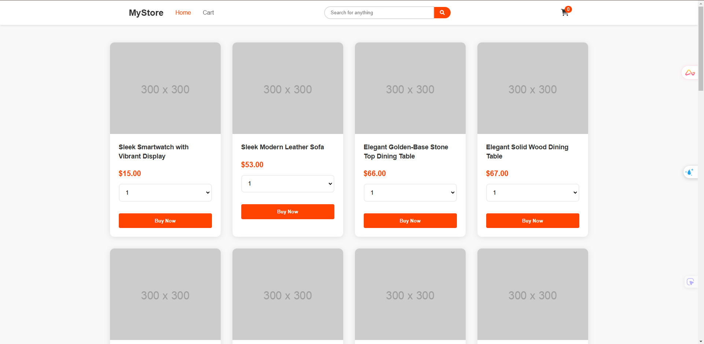
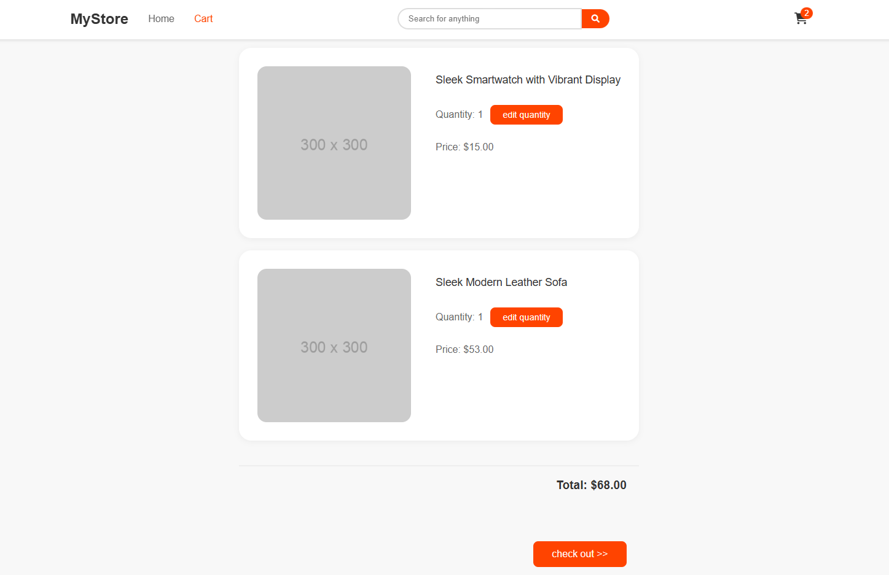

# E-commerce Shopping Cart Project


A responsive e-commerce website with shopping cart functionality built using vanilla JavaScript, HTML, and CSS.

## Demo Screenshots

| Home Page | Cart Overlay | Checkout Page |
|-----------|--------------|---------------|
||||

## Features
- Product listing with grid layout
- Shopping cart functionality with persistent storage
- Real-time search functionality
- Quantity selection and editing
- Dynamic cart total calculation
- Responsive design for all devices
- Cart item deletion
- Checkout page with order summary

## Technical Features
- Vanilla JavaScript (No frameworks)
- CSS Grid and Flexbox
- LocalStorage for cart persistence
- REST API integration
- Responsive images
- Error handling

## Known Issues: Image Loading

### API Image Issue
The project uses the Platzi Fake Store API which sometimes returns invalid image URLs:


### Error Handling Solution
```javascript
// Image error handling with fallback
img.setAttribute("onerror", "this.src='https://via.placeholder.com/300'")
```

## Project Structure
```
project/
├── images/
│   ├── Home.png
│   ├── cart overlay.png
│   ├── checkout.png
│   └── error image.png
├── index.html
├── pages/
│   └── checkOut.html
├── styles/
│   └── styles.css
└── scripts/
    ├── index.js
    ├── checkOut.js
    └── objects.js
```


## Future Improvements
1. Add image URL validation and cleaning
2. Implement better error handling for API responses
3. Add loading states while images are fetching
4. Consider implementing image lazy loading
5. Add local image caching
6. Add user authentication
7. Implement payment gateway integration

## Usage
1. Clone the repository
2. Open index.html in a modern browser
3. No build process required - vanilla JavaScript project

## Browser Support
- Chrome (latest)
- Firefox (latest)
- Safari (latest)
- Edge (latest)

## Contributing
Feel free to open issues and pull requests!

## License
MIT License - feel free to use this project for learning purposes.